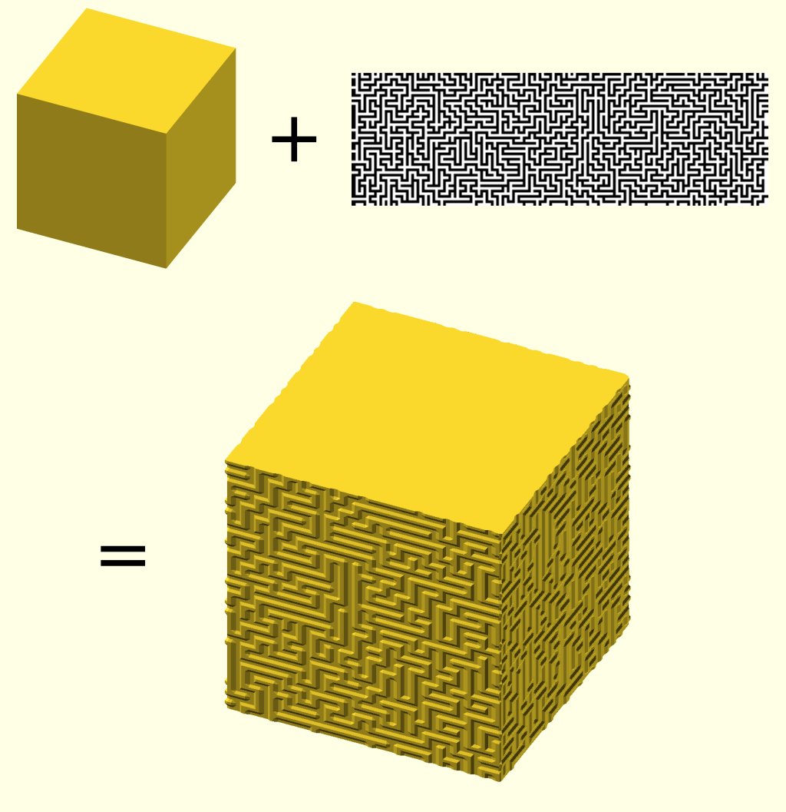

# texture-surface
Textured parametric surfaces in OpenSCAD

This library allows you to create textured 3D objects in OpenSCAD.

* The 3D objects are defined as [parametric surfaces](https://en.wikipedia.org/wiki/Parametric_surface), i.e., a mathematical function defines the shape.
* The textures are 2D arrays, where each value represents a bump in the surface.

The image below illustrates the basic operation:

To get started, see [demo.scad](demo.scad).

The library requires OpenSCAD version 2021.01 or later.
